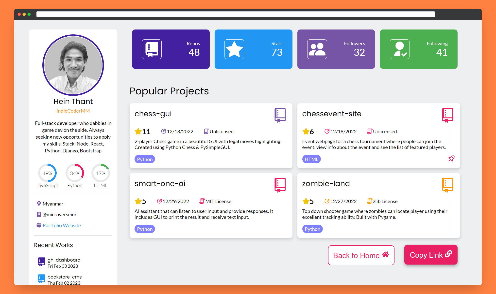

<a name="readme-top"></a>

## 📑 Table of Contents
- [📊 GitHub Dashboard Generator ](#-github-dashboard-generator-)
  - [🛠 Built With ](#-built-with-)
    - [🧰 Tech Stack ](#-tech-stack-)
    - [💎 Key Features ](#-key-features-)
  - [🚀 Live Demo ](#-live-demo-)
  - [💻 Getting Started ](#-getting-started-)
    - [Prerequisites](#prerequisites)
    - [Setup](#setup)
    - [Install](#install)
    - [Usage](#usage)
    - [Deployment](#deployment)
  - [📧 Contact ](#-contact-)
  - [🔭 Future Features ](#-future-features-)
  - [🤝 Contributing ](#-contributing-)
  - [💖 Show your support ](#-show-your-support-)
  - [🙏 Acknowledgments ](#-acknowledgments-)
  - [📝 License ](#-license-)

<!-- PROJECT DESCRIPTION -->

# 📊 GitHub Dashboard Generator <a name="about-project"></a>

A web-based application that creates a dashboard for a user by using data from the GitHub API. Simply enter a GitHub username and the app will generate a dashboard displaying overview of relevant information. Users can also copy the link to their dashboard for easy access.



## 🛠 Built With <a name="built-with"></a>

### 🧰 Tech Stack <a name="tech-stack"></a>

- 
- 
- 
- 
- 

<!-- Features -->

### 💎 Key Features <a name="key-features"></a>

- Generate a comprehensive dashboard using data from GitHub API 💻
- Overview of repositories, followers, stars and more 📈
- Beautifully designed and easy-to-use 🎨
- Instant snapshot of your GitHub presence 📸
- Save your dashboard link for easy access 🔗

<p align="right">(<a href="#readme-top">back to top</a>)</p>

<!-- LIVE DEMO -->

## 🚀 Live Demo <a name="live-demo"></a>

You can generate your dashboard on [GitHub Dashboard Generator](https://gh-dashboard-icmm.onrender.com/).

<p align="right">(<a href="#readme-top">back to top</a>)</p>

<!-- GETTING STARTED -->

## 💻 Getting Started <a name="getting-started"></a>

To get a local copy up and running, follow these steps.

### Prerequisites

In order to run this project you need [Node.js](https://nodejs.org/en/) installed on your machine.

### Setup

Clone this repository to your desired folder:

```sh
  cd my-project
  git clone git@github.com:IndieCoderMM/gh-dashboard.git .
```

### Install

Install the dependencies with:

```sh
  npm install
```

### Usage

To run the project, execute the following command:

```sh
  npm start
```

<!-- ### Run tests

To run tests, run the following command:

```sh
  npm run test
``` -->

### Deployment

You can deploy this project using:

```sh
  npm run build
```
This will create a production-ready build of your website in `build/` folder, which you can use to deploy on a static site server.

<p align="right">(<a href="#readme-top">back to top</a>)</p>

<!-- AUTHORS -->

## 📧 Contact <a name="authors"></a>

I am always looking for ways to improve my project. If you have any suggestions or ideas, I would love to hear from you.

[](https://github.com/IndieCoderMM)
[](https://twitter.com/hthant_oo)
[](https://linkedin.com/in/hthantoo)
[](mailto:hthant00chk@gmail.com)


<p align="right">(<a href="#readme-top">back to top</a>)</p>

<!-- FUTURE FEATURES -->

## 🔭 Future Features <a name="future-features"></a>

- [x] **Mobile UI**
- [ ] **Visualize contribution**

<p align="right">(<a href="#readme-top">back to top</a>)</p>

<!-- CONTRIBUTING -->

## 🤝 Contributing <a name="contributing"></a>

I welcome any and all contributions to my website! If you have an idea for a new feature or have found a bug, please open an issue or submit a pull request.

Feel free to check the [issues page](../../issues/).

<p align="right">(<a href="#readme-top">back to top</a>)</p>

<!-- SUPPORT -->

## 💖 Show your support <a name="support"></a>

If you like this project, please consider giving it a ⭐.

<p align="right">(<a href="#readme-top">back to top</a>)</p>

<!-- ACKNOWLEDGEMENTS -->

## 🙏 Acknowledgments <a name="acknowledgements"></a>

This project was inspired by:
- [GitHub Finder](https://github.com/JasurbekIsokov/github-finder)
- [GitHub Profile Finder](https://devpost.com/software/github-profile-finder)

<p align="right">(<a href="#readme-top">back to top</a>)</p>

<!-- LICENSE -->

## 📝 License <a name="license"></a>

This project is [MIT](./LICENSE) licensed.

<p align="right">(<a href="#readme-top">back to top</a>)</p>
